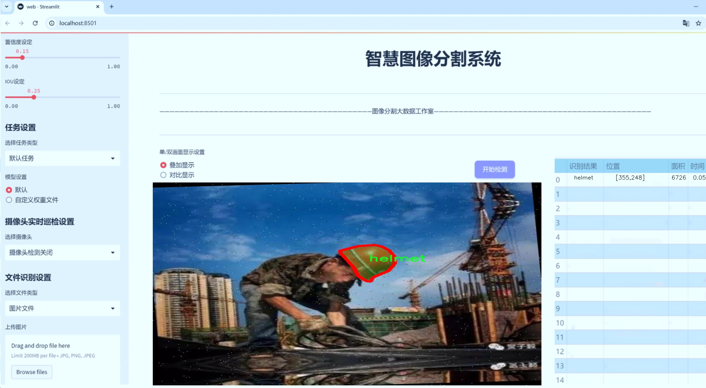
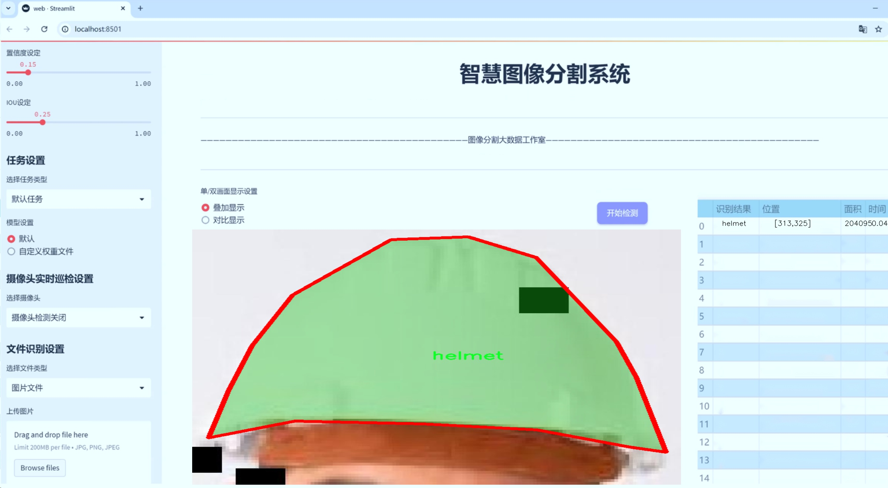
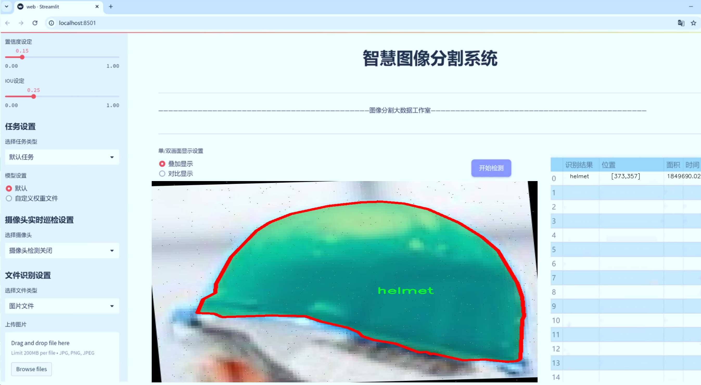
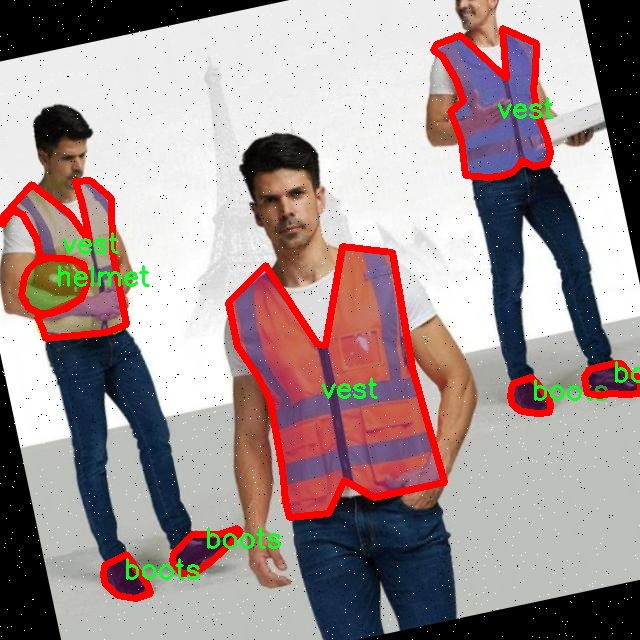
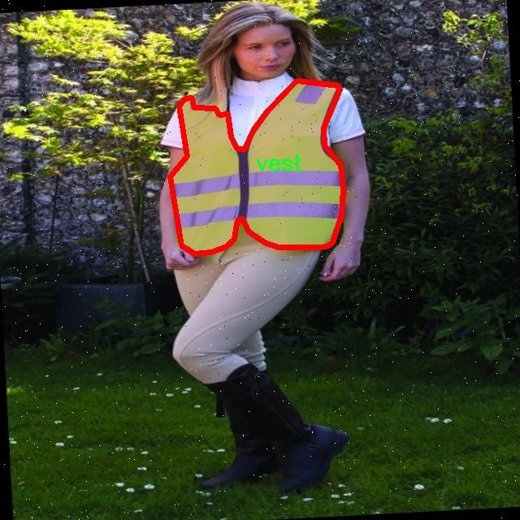
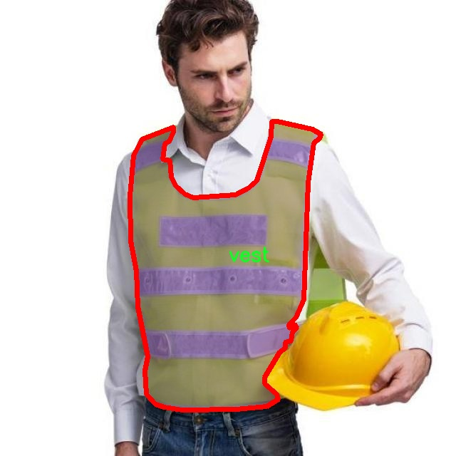
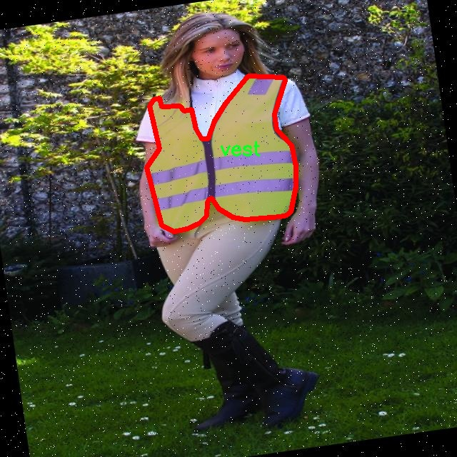
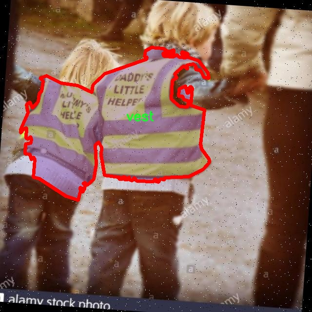

# 个人防护装备分割系统源码＆数据集分享
 [yolov8-seg-swintransformer＆yolov8-seg-C2f-EMSC等50+全套改进创新点发刊_一键训练教程_Web前端展示]

### 1.研究背景与意义

项目参考[ILSVRC ImageNet Large Scale Visual Recognition Challenge](https://gitee.com/YOLOv8_YOLOv11_Segmentation_Studio/projects)

项目来源[AAAI Global Al lnnovation Contest](https://kdocs.cn/l/cszuIiCKVNis)

研究背景与意义

随着工业化进程的加快，个人防护装备（PPE）在各类工作环境中的重要性日益凸显。PPE的有效使用不仅能保护工人的生命安全，还能减少因工伤导致的经济损失。因此，如何快速、准确地识别和分割个人防护装备，成为了当前安全生产领域亟待解决的技术难题。传统的人工检测方法不仅效率低下，而且容易受到人为因素的影响，导致误判和漏判的发生。因此，基于计算机视觉和深度学习技术的自动化检测系统应运而生，成为提升个人防护装备管理和监控水平的重要手段。

YOLO（You Only Look Once）系列模型因其高效的实时检测能力而广泛应用于目标检测领域。YOLOv8作为该系列的最新版本，具备了更强的特征提取能力和更快的推理速度，能够在复杂的环境中实现高精度的目标检测。然而，针对个人防护装备的实例分割任务，YOLOv8仍存在一定的局限性，尤其是在小目标检测和重叠目标分割方面。因此，改进YOLOv8以适应个人防护装备的分割需求，具有重要的研究价值和实际意义。

本研究将基于改进的YOLOv8模型，构建一个高效的个人防护装备分割系统。我们将使用包含2400张图像的数据集，该数据集涵盖了六类防护装备：靴子、眼镜、手套、安全帽、人员和背心。这些类别的多样性和复杂性为模型的训练和评估提供了丰富的样本，有助于提升模型的泛化能力和适应性。通过对数据集的深入分析和特征提取，我们将针对每一类防护装备的特征进行优化，以提高模型在实例分割任务中的表现。

此外，个人防护装备的分割系统不仅在工业安全领域具有广泛的应用前景，还可以扩展到其他领域，如建筑、化工、医疗等行业的安全监控。通过实现对个人防护装备的自动检测和分割，能够有效提高安全管理的效率，减少人为疏忽带来的风险。同时，该系统的推广应用也将推动相关技术的发展，促进人工智能在安全生产领域的深入应用。

综上所述，基于改进YOLOv8的个人防护装备分割系统的研究，不仅具有重要的理论意义，还具有广泛的实际应用价值。通过本研究的开展，我们期望能够为提升个人防护装备的使用效率和安全性提供新的技术手段，为构建更加安全的工作环境贡献力量。

### 2.图片演示







##### 注意：由于此博客编辑较早，上面“2.图片演示”和“3.视频演示”展示的系统图片或者视频可能为老版本，新版本在老版本的基础上升级如下：（实际效果以升级的新版本为准）

  （1）适配了YOLOV8的“目标检测”模型和“实例分割”模型，通过加载相应的权重（.pt）文件即可自适应加载模型。

  （2）支持“图片识别”、“视频识别”、“摄像头实时识别”三种识别模式。

  （3）支持“图片识别”、“视频识别”、“摄像头实时识别”三种识别结果保存导出，解决手动导出（容易卡顿出现爆内存）存在的问题，识别完自动保存结果并导出到tempDir中。

  （4）支持Web前端系统中的标题、背景图等自定义修改，后面提供修改教程。

  另外本项目提供训练的数据集和训练教程,暂不提供权重文件（best.pt）,需要您按照教程进行训练后实现图片演示和Web前端界面演示的效果。

### 3.视频演示

[3.1 视频演示](https://www.bilibili.com/video/BV17K22YEE6t/)

### 4.数据集信息展示

##### 4.1 本项目数据集详细数据（类别数＆类别名）

nc: 6
names: ['boots', 'glasses', 'gloves', 'helmet', 'person', 'vest']


##### 4.2 本项目数据集信息介绍

数据集信息展示

在现代工业和建筑环境中，个人防护装备（PPE）的有效使用至关重要，以确保工人的安全和健康。为此，开发一个高效的个人防护装备分割系统显得尤为重要。本研究所采用的数据集名为“EPI detection”，旨在为改进YOLOv8-seg模型提供丰富的训练数据，从而实现对个人防护装备的精准识别与分割。

“EPI detection”数据集包含六个主要类别，分别是：靴子（boots）、眼镜（glasses）、手套（gloves）、头盔（helmet）、人员（person）和背心（vest）。这些类别不仅涵盖了工人所需的基本防护装备，还考虑到了不同工作环境中的多样性和复杂性。通过对这些类别的细致划分，数据集能够为模型提供全面的训练样本，使其在实际应用中能够更好地适应各种场景。

在数据集的构建过程中，研究团队注重数据的多样性和代表性。每个类别的样本均来自于不同的工作环境，包括建筑工地、制造厂房和实验室等。这种多样性确保了模型在不同场景下的鲁棒性，使其能够准确识别和分割各种个人防护装备。例如，靴子类别不仅包括传统的工作靴，还涵盖了防水靴和绝缘靴，以应对不同的安全需求。眼镜类别则包含了防护眼镜和普通眼镜，确保模型能够区分不同类型的眼部保护装备。

此外，数据集中的图像经过精心标注，确保每个样本的标签准确无误。标注工作由经验丰富的专业人员完成，他们对个人防护装备的特征有着深刻的理解。这种专业的标注不仅提高了数据集的质量，也为后续的模型训练提供了坚实的基础。通过精确的标注，模型能够学习到每种装备的独特特征，从而在分割任务中表现出色。

在数据集的规模方面，“EPI detection”包含了大量的图像样本，确保了模型在训练过程中的有效性和可靠性。数据集的丰富性使得模型能够在面对新数据时，依然保持较高的准确率和召回率。此外，数据集还包括了多种光照条件和视角变化的样本，进一步增强了模型的适应能力。

通过使用“EPI detection”数据集，研究团队期望能够显著提升YOLOv8-seg模型在个人防护装备分割任务中的性能。该数据集不仅为模型提供了必要的训练基础，也为后续的研究和应用奠定了良好的基础。随着对个人防护装备识别技术的不断深入，未来的研究将能够更好地服务于工人安全和健康管理，推动相关领域的技术进步与发展。











### 5.全套项目环境部署视频教程（零基础手把手教学）

[5.1 环境部署教程链接（零基础手把手教学）](https://www.bilibili.com/video/BV1jG4Ve4E9t/?vd_source=bc9aec86d164b67a7004b996143742dc)


[5.2 安装Python虚拟环境创建和依赖库安装视频教程链接（零基础手把手教学）](https://www.bilibili.com/video/BV1nA4VeYEze/?vd_source=bc9aec86d164b67a7004b996143742dc)

### 6.手把手YOLOV8-seg训练视频教程（零基础小白有手就能学会）

[6.1 手把手YOLOV8-seg训练视频教程（零基础小白有手就能学会）](https://www.bilibili.com/video/BV1cA4VeYETe/?vd_source=bc9aec86d164b67a7004b996143742dc)


按照上面的训练视频教程链接加载项目提供的数据集，运行train.py即可开始训练



     Epoch   gpu_mem       box       obj       cls    labels  img_size
     1/200     0G   0.01576   0.01955  0.007536        22      1280: 100%|██████████| 849/849 [14:42<00:00,  1.04s/it]
               Class     Images     Labels          P          R     mAP@.5 mAP@.5:.95: 100%|██████████| 213/213 [01:14<00:00,  2.87it/s]
                 all       3395      17314      0.994      0.957      0.0957      0.0843

     Epoch   gpu_mem       box       obj       cls    labels  img_size
     2/200     0G   0.01578   0.01923  0.007006        22      1280: 100%|██████████| 849/849 [14:44<00:00,  1.04s/it]
               Class     Images     Labels          P          R     mAP@.5 mAP@.5:.95: 100%|██████████| 213/213 [01:12<00:00,  2.95it/s]
                 all       3395      17314      0.996      0.956      0.0957      0.0845

     Epoch   gpu_mem       box       obj       cls    labels  img_size
     3/200     0G   0.01561    0.0191  0.006895        27      1280: 100%|██████████| 849/849 [10:56<00:00,  1.29it/s]
               Class     Images     Labels          P          R     mAP@.5 mAP@.5:.95: 100%|███████   | 187/213 [00:52<00:00,  4.04it/s]
                 all       3395      17314      0.996      0.957      0.0957      0.0845


### 7.50+种全套YOLOV8-seg创新点代码加载调参视频教程（一键加载写好的改进模型的配置文件）

[7.1 50+种全套YOLOV8-seg创新点代码加载调参视频教程（一键加载写好的改进模型的配置文件）](https://www.bilibili.com/video/BV1Hw4VePEXv/?vd_source=bc9aec86d164b67a7004b996143742dc)

### 8.YOLOV8-seg图像分割算法原理

原始YOLOv8-seg算法原理

YOLOv8-seg算法是Ultralytics公司在2023年推出的YOLO系列最新版本，它在目标检测的基础上，进一步扩展了语义分割的能力，成为一种集目标检测与分割于一体的高效算法。YOLOv8-seg的设计理念是通过改进卷积神经网络结构，提升模型的准确性和实时性，以适应日益复杂的视觉识别任务。与前代YOLO模型相比，YOLOv8-seg在多个方面进行了创新和优化，使其在精度和速度上都取得了显著的提升。

首先，YOLOv8-seg采用了更深的卷积神经网络结构，这一设计使得模型能够更好地提取图像中的特征信息。通过引入C2f模块替代YOLOv5中的C3模块，YOLOv8-seg实现了特征提取的高效性和灵活性。C2f模块的设计允许网络在提取特征时进行更深层次的特征融合，从而增强了模型对复杂场景的理解能力。此外，YOLOv8-seg的主干网络采用了CSP（Cross Stage Partial）结构，这种结构将特征提取过程分为两部分，分别进行卷积和连接，有效地减少了计算量并提高了模型的表达能力。

在特征融合方面，YOLOv8-seg引入了PAN-FPN（Path Aggregation Network - Feature Pyramid Network）结构，进一步增强了多尺度特征的融合能力。PAN-FPN通过对不同层次的特征进行聚合，使得模型能够更好地处理各种尺度的目标。这一特性在实际应用中尤为重要，因为在复杂的场景中，目标的大小和形状各异，YOLOv8-seg能够通过多尺度特征的融合，提升对小目标和大目标的检测精度。

YOLOv8-seg还采用了Anchor-Free的检测方式，这一创新使得模型在目标检测时不再依赖于预定义的锚框，从而减少了模型的复杂性和计算负担。传统的锚框方法往往需要手动调整和优化，而YOLOv8-seg通过解耦头结构（Decoupled Head）来实现目标的直接检测，这种方式不仅提高了检测速度，也增强了模型的适应性。

在损失函数的设计上，YOLOv8-seg使用了CloU（Class Loss with Uncertainty）损失函数，该损失函数通过引入不确定性度量，使得模型在训练过程中能够更好地处理类别不平衡的问题。这一设计使得YOLOv8-seg在面对复杂背景和多类别目标时，依然能够保持较高的检测精度。

为了提升模型的整体性能，YOLOv8-seg还引入了多尺度训练和测试策略。这一策略通过在不同尺度下训练模型，使得YOLOv8-seg能够更好地适应不同尺寸的输入图像，从而提高了模型的泛化能力。此外，YOLOv8-seg还采用了特征金字塔网络（FPN）技术，使得模型在进行目标检测时，能够有效地利用不同层次的特征信息，从而进一步提升检测的准确性。

YOLOv8-seg的应用场景非常广泛，包括智能监控、自动驾驶、医疗影像分析等。在智能监控领域，YOLOv8-seg能够实时检测和分割监控画面中的目标，提升安全性和管理效率。在自动驾驶中，YOLOv8-seg可以帮助车辆识别道路上的行人、车辆和交通标志，从而提高行车安全性。在医疗影像分析中，YOLOv8-seg能够对医学影像中的病灶进行精准定位和分割，辅助医生进行诊断。

综上所述，YOLOv8-seg算法通过深度卷积神经网络、C2f模块、PAN-FPN结构、Anchor-Free检测方式以及CloU损失函数等一系列创新设计，极大地提升了目标检测和分割的性能。它不仅在精度和速度上取得了显著的提升，还具备了良好的适应性和泛化能力，使其在各种复杂场景中都能表现出色。随着YOLOv8-seg的不断发展和应用，未来在视觉识别领域的潜力将更加广阔，为各类智能应用提供更为强大的技术支持。


### 9.系统功能展示（检测对象为举例，实际内容以本项目数据集为准）

图9.1.系统支持检测结果表格显示

  图9.2.系统支持置信度和IOU阈值手动调节

  图9.3.系统支持自定义加载权重文件best.pt(需要你通过步骤5中训练获得)

  图9.4.系统支持摄像头实时识别

  图9.5.系统支持图片识别

  图9.6.系统支持视频识别

  图9.7.系统支持识别结果文件自动保存

  图9.8.系统支持Excel导出检测结果数据


### 10.50+种全套YOLOV8-seg创新点原理讲解（非科班也可以轻松写刊发刊，V11版本正在科研待更新）

#### 10.1 由于篇幅限制，每个创新点的具体原理讲解就不一一展开，具体见下列网址中的创新点对应子项目的技术原理博客网址【Blog】：


[10.1 50+种全套YOLOV8-seg创新点原理讲解链接](https://gitee.com/qunmasj/good)

#### 10.2 部分改进模块原理讲解(完整的改进原理见上图和技术博客链接)【如果此小节的图加载失败可以通过CSDN或者Github搜索该博客的标题访问原始博客，原始博客图片显示正常】
### YOLOv8模型原理

YOLOv8是YOLO系列最新的模型,具有非常优秀的检测精度和速度。根据网络的深度与特征图的宽度大小, YOLOv8算法分为:YOLOv8-n、YOLOv8一s 、YOLOv8-m 、 YOLOv8-l、和 YOLOv8-x 5个版本。按照网络结构图,YOLOv8可分为: Inpul 、 Backbone , Neck和Head 4部分。


Backbone采用了CSPDarknet 架构，由CBS (标准卷积层)、C2f模块和 SPPF(金字塔池化）组成。通过5次标准卷积层和C2f模块逐步提取图像特征，并在网络末尾添加SPPF模块，将任意大小的输入图像转换成固定大小的特征向量。分别取P3、P4、P5层的特征提取结果，向Head输出80×80、40 × 40、20×20三个尺度的特征层。
C2f模块借鉴了残差网络(ResNet)以及ELAN的思想，其结构分为两个分支，主干部分利用Bottleneckm2%模块逐步加深网络，分支部分保留输入层通道并与主干部分特征进行融合，如图所示。通过标准卷积层提取新的特征层，相比于YOLOv5使用的C3模块，C2f模块可以在卷积层和全连接层之间建立一个平滑的转换，从而实现了参数的共享，提高了模型的效率和泛化能力。
Head采用了PAN-FPN 结构,将 Backbone输入的3个特征层进行多尺度融合，进行自顶向下(FAN)和自底向上 (PAN)的特征传递，对金字塔进行增强，使不同尺寸的特征图都包含强目标语义信息和强目标特征信息，保证了对不同尺寸样本的准确预测。
Detect借鉴了Decoupled-Head 思想，用一个解耦检测头将输入的不同尺寸特征层分成2个分支进行检测。第1个分支在进行3次卷积后使进行回归任务，输出预测框。第2个分支在进行3次卷积后进行分类任务，输出类别的概率。采用Varifocal_Loss2”作为损失函数，其式为:


### Context_Grided_Network(CGNet)简介
参考该博客提出的一种轻量化语义分割模型Context Grided Network(CGNet)，以满足设备的运行需要。

CGNet主要由CG块构建而成，CG块可以学习局部特征和周围环境上下文的联合特征，最后通过引入全局上下文特征进一步改善联合特征的学习。


 
下图给出了在Cityscapes数据集上对现有的一些语义分割模型的测试效果，横轴表示参数量，纵轴表示准确率(mIoU)。可以看出，在参数量较少的情况下，CGNet可以达到一个比较好的准确率。虽与高精度模型相去甚远，但在一些对精度要求不高、对实时性要求比较苛刻的情况下，很有价值。


高精度模型，如DeepLab、DFN、DenseASPP等，动不动就是几十M的参数，很难应用在移动设备上。而上图中红色的模型，相对内存占用较小，但它们的分割精度却不是很高。作者认为主要原因是，这些小网络大多遵循着分类网络的设计思路，并没有考虑语义分割任务更深层次的特点。

空间依赖性和上下文信息对提高分割精度有很大的作用。作者从该角度出发，提出了CG block，并进一步搭建了轻量级语义分割网络CGNet。CG块具有以下特点： 

学习局部特征和上下文特征的联合特征；
通过全局上下文特征改进上述联合特征；
可以贯穿应用在整个网络中，从low level（空间级别）到high level（语义级别）。不像PSPNet、DFN、DenseASPP等，只在编码阶段以后捕捉上下文特征。；
只有3个下采样，相比一般5个下采样的网络，能够更好地保留边缘信息。
CGNet遵循“深而薄”的原则设计，整个网络又51层构成。其中，为了降低计算，大量使用了channel-wise conv.

小型语义分割模型：

需要平衡准确率和系统开销
进化路线：ENet -> ICNet -> ESPNet
这些模型基本都基于分类网络设计，在分割准确率上效果并不是很好
上下文信息模型：

大多数现有模型只考虑解码阶段的上下文信息并且没有利用周围的上下文信息
注意力机制：

CG block使用全局上下文信息计算权重向量，并使用其细化局部特征和周围上下文特征的联合特征

#### Context Guided Block
CG block由4部分组成：


此外，CG block还采用了残差学习。文中提出了局部残差学习（LRL）和全局残差学习（GRL）两种方式。 LRL添加了从输入到联合特征提取器的连接，GRL添加了从输入到全局特征提取器的连接。从直观上来说，GRL比LRL更能促进网络中的信息传递（更像ResNet~~），后面实验部分也进行了测试，的确GRL更能提升分割精度。


CGNet的通用网络结构如下图所示，分为3个stage，第一个stage使用3个卷积层抽取特征，第二和第三个stage堆叠一定数量的CG block，具体个数可以根据情况调整。最后，通过1x1 conv得到分割结果。


下图是用于Cityscapes数据集的CGNet网络细节说明：输入尺寸为3*680*680；stage1连续使用了3个Conv-BN-PReLU组合，首个组合使用了stride=2的卷积，所以得到了1/2分辨率的feature map；stage2和stage3分别使用了多个CG block，且其中使用了不同大小的膨胀卷积核，最终分别得到了1/4和1/8的feature map。

需注意：

stage2&3的输入特征分别由其上一个stage的首个和最后一个block组合给出（参考上图的绿色箭头）；

输入注入机制，图中未体现，实际使用中，作者还将输入图像下采样1/4或1/8，分别给到stage2和stage3的输入中 ，以进一步加强特征传递。

channel-wise conv。为了缩减参数数量，在局部特征提取器和周围上下文特征提取器中使用了channel-wise卷积，可以消除跨通道的计算成本，同时节省内存占用。但是，没有像MobileNet等模型一样，在depth-wise卷积后面接point-wise卷积（1*1 conv），作者解释是，因为CG block需要保持局部特征和周围上下文特征的独立性，而1*1 conv会破坏这种独立性，所以效果欠佳，实验部分也进行了验证。

个人感觉此处应该指的是depth-wise卷积？

官方Git中对该部分的实现如下：


### 11.项目核心源码讲解（再也不用担心看不懂代码逻辑）

#### 11.1 ultralytics\engine\results.py

以下是对代码中最核心部分的提炼和详细中文注释：

```python
class BaseTensor(SimpleClass):
    """基础张量类，提供便捷的操作和设备处理方法。"""

    def __init__(self, data, orig_shape) -> None:
        """
        初始化BaseTensor，包含数据和原始形状。

        参数:
            data (torch.Tensor | np.ndarray): 预测结果，例如边界框、掩码和关键点。
            orig_shape (tuple): 图像的原始形状。
        """
        assert isinstance(data, (torch.Tensor, np.ndarray))  # 确保数据是张量或数组
        self.data = data  # 存储数据
        self.orig_shape = orig_shape  # 存储原始形状

    @property
    def shape(self):
        """返回数据张量的形状。"""
        return self.data.shape

    def cpu(self):
        """返回一个在CPU内存上的张量副本。"""
        return self if isinstance(self.data, np.ndarray) else self.__class__(self.data.cpu(), self.orig_shape)

    def numpy(self):
        """返回一个作为numpy数组的张量副本。"""
        return self if isinstance(self.data, np.ndarray) else self.__class__(self.data.numpy(), self.orig_shape)

    def cuda(self):
        """返回一个在GPU内存上的张量副本。"""
        return self.__class__(torch.as_tensor(self.data).cuda(), self.orig_shape)

    def to(self, *args, **kwargs):
        """返回一个具有指定设备和数据类型的张量副本。"""
        return self.__class__(torch.as_tensor(self.data).to(*args, **kwargs), self.orig_shape)

    def __len__(self):  # 重写len(results)
        """返回数据张量的长度。"""
        return len(self.data)

    def __getitem__(self, idx):
        """返回指定索引的数据张量的BaseTensor副本。"""
        return self.__class__(self.data[idx], self.orig_shape)


class Results(SimpleClass):
    """
    存储和操作推理结果的类。

    参数:
        orig_img (numpy.ndarray): 原始图像的numpy数组。
        path (str): 图像文件的路径。
        names (dict): 类别名称的字典。
        boxes (torch.tensor, optional): 每个检测的边界框坐标的2D张量。
        masks (torch.tensor, optional): 检测掩码的3D张量，每个掩码是一个二进制图像。
        probs (torch.tensor, optional): 每个类别的概率的1D张量。
        keypoints (List[List[float]], optional): 每个对象的检测关键点列表。
    """

    def __init__(self, orig_img, path, names, boxes=None, masks=None, probs=None, keypoints=None) -> None:
        """初始化Results类。"""
        self.orig_img = orig_img  # 存储原始图像
        self.orig_shape = orig_img.shape[:2]  # 存储原始图像的形状
        self.boxes = Boxes(boxes, self.orig_shape) if boxes is not None else None  # 存储边界框
        self.masks = Masks(masks, self.orig_shape) if masks is not None else None  # 存储掩码
        self.probs = Probs(probs) if probs is not None else None  # 存储概率
        self.keypoints = Keypoints(keypoints, self.orig_shape) if keypoints is not None else None  # 存储关键点
        self.names = names  # 存储类别名称
        self.path = path  # 存储图像路径

    def update(self, boxes=None, masks=None, probs=None):
        """更新Results对象的边界框、掩码和概率属性。"""
        if boxes is not None:
            ops.clip_boxes(boxes, self.orig_shape)  # 裁剪边界框
            self.boxes = Boxes(boxes, self.orig_shape)
        if masks is not None:
            self.masks = Masks(masks, self.orig_shape)
        if probs is not None:
            self.probs = probs

    def plot(self, conf=True, labels=True, boxes=True, masks=True):
        """
        在输入RGB图像上绘制检测结果。

        参数:
            conf (bool): 是否绘制检测置信度分数。
            labels (bool): 是否绘制边界框的标签。
            boxes (bool): 是否绘制边界框。
            masks (bool): 是否绘制掩码。

        返回:
            (numpy.ndarray): 注释后的图像的numpy数组。
        """
        # 省略其他参数处理，专注于绘制逻辑
        annotator = Annotator(deepcopy(self.orig_img), line_width=None, font_size=None, font='Arial.ttf', pil=False, example=self.names)

        # 绘制掩码结果
        if self.masks and masks:
            annotator.masks(self.masks.data, colors=[colors(x, True) for x in self.boxes.cls])

        # 绘制边界框结果
        if self.boxes and boxes:
            for d in reversed(self.boxes):
                label = f'{self.names[int(d.cls)]} {d.conf:.2f}' if labels else None
                annotator.box_label(d.xyxy.squeeze(), label, color=colors(int(d.cls), True))

        return annotator.result()  # 返回绘制后的图像


class Boxes(BaseTensor):
    """
    存储和操作检测边界框的类。

    参数:
        boxes (torch.Tensor | numpy.ndarray): 包含检测边界框的张量或numpy数组。
        orig_shape (tuple): 原始图像大小，格式为(height, width)。
    """

    def __init__(self, boxes, orig_shape) -> None:
        """初始化Boxes类。"""
        if boxes.ndim == 1:
            boxes = boxes[None, :]  # 确保boxes是二维的
        super().__init__(boxes, orig_shape)  # 调用父类构造函数

    @property
    def xyxy(self):
        """返回边界框的xyxy格式。"""
        return self.data[:, :4]

    @property
    def conf(self):
        """返回边界框的置信度值。"""
        return self.data[:, -2]

    @property
    def cls(self):
        """返回边界框的类别值。"""
        return self.data[:, -1]


class Masks(BaseTensor):
    """
    存储和操作检测掩码的类。
    """

    def __init__(self, masks, orig_shape) -> None:
        """初始化Masks类。"""
        if masks.ndim == 2:
            masks = masks[None, :]  # 确保masks是三维的
        super().__init__(masks, orig_shape)  # 调用父类构造函数

    @property
    def xyn(self):
        """返回归一化的掩码分段。"""
        return [ops.scale_coords(self.data.shape[1:], x, self.orig_shape, normalize=True) for x in ops.masks2segments(self.data)]

    @property
    def xy(self):
        """返回像素坐标的掩码分段。"""
        return [ops.scale_coords(self.data.shape[1:], x, self.orig_shape, normalize=False) for x in ops.masks2segments(self.data)]
```

### 核心部分说明
1. **BaseTensor**: 这是一个基础类，提供了处理张量的基本功能，包括在不同设备之间的转换（CPU、GPU）和数据格式的转换（numpy数组）。
2. **Results**: 这个类用于存储推理结果，包括原始图像、边界框、掩码、概率和关键点等信息，并提供更新和绘制结果的方法。
3. **Boxes 和 Masks**: 这两个类分别用于处理检测到的边界框和掩码，提供了获取相关信息（如坐标、置信度、类别等）的方法。

以上代码是YOLO推理结果处理的核心部分，能够有效地管理和展示检测结果。

该文件是Ultralytics YOLO（You Only Look Once）目标检测框架的一部分，主要用于处理推理结果，包括检测框、掩码和关键点等。文件中定义了多个类，每个类负责不同类型的数据处理和存储。

首先，`BaseTensor`类是一个基础类，提供了一些通用的方法来处理张量数据。它支持在CPU和GPU之间移动数据，并可以将张量转换为NumPy数组。该类的构造函数接受数据和原始图像的形状，并提供了获取张量形状、长度以及索引的功能。

接下来是`Results`类，它用于存储和操作推理结果。该类的构造函数接受原始图像、文件路径、类别名称以及可选的检测框、掩码、概率和关键点。它还提供了更新检测框、掩码和概率的方法，以及将结果转换为不同格式（如CPU、NumPy、CUDA等）的方法。此外，`Results`类还提供了绘制检测结果的功能，可以在输入图像上绘制检测框、掩码和关键点，并返回带注释的图像。

`Boxes`类专门用于处理检测框。它继承自`BaseTensor`，并提供了获取框的不同格式（如xyxy、xywh、归一化格式等）的方法。该类还包含了跟踪ID的支持。

`Masks`类用于处理检测掩码，同样继承自`BaseTensor`。它提供了获取掩码的像素坐标和归一化坐标的方法。

`Keypoints`类用于处理检测到的关键点，提供了获取关键点坐标和置信度的方法。该类在初始化时会根据置信度过滤掉不可见的关键点。

最后，`Probs`类用于处理分类任务的概率，提供了获取前五个类别及其置信度的方法。

整个文件通过这些类的组合，实现了对YOLO模型推理结果的全面处理，包括结果的存储、更新、转换和可视化等功能。这些功能使得用户能够方便地获取和操作目标检测的结果，便于后续的分析和应用。

#### 11.2 ui.py

以下是代码中最核心的部分，并附上详细的中文注释：

```python
import sys
import subprocess

def run_script(script_path):
    """
    使用当前 Python 环境运行指定的脚本。

    Args:
        script_path (str): 要运行的脚本路径

    Returns:
        None
    """
    # 获取当前 Python 解释器的路径
    python_path = sys.executable

    # 构建运行命令，使用 streamlit 运行指定的脚本
    command = f'"{python_path}" -m streamlit run "{script_path}"'

    # 执行命令
    result = subprocess.run(command, shell=True)
    # 检查命令执行的返回码，如果不为0，表示执行出错
    if result.returncode != 0:
        print("脚本运行出错。")


# 实例化并运行应用
if __name__ == "__main__":
    # 指定要运行的脚本路径
    script_path = "web.py"  # 假设脚本在当前目录下

    # 调用函数运行脚本
    run_script(script_path)
```

### 代码注释说明：
1. **导入模块**：
   - `sys`：用于获取当前 Python 解释器的路径。
   - `subprocess`：用于执行外部命令。

2. **`run_script` 函数**：
   - 功能：使用当前 Python 环境运行指定的脚本。
   - 参数：`script_path`，表示要运行的脚本的路径。
   - 获取当前 Python 解释器的路径，并构建一个命令来运行 `streamlit`。

3. **执行命令**：
   - 使用 `subprocess.run` 执行构建的命令。
   - 检查命令的返回码，如果返回码不为0，表示脚本运行出错，打印错误信息。

4. **主程序入口**：
   - 当脚本作为主程序运行时，指定要运行的脚本路径（此处假设为 `web.py`）。
   - 调用 `run_script` 函数来执行指定的脚本。

这个程序文件名为 `ui.py`，主要功能是通过当前的 Python 环境运行一个指定的脚本。程序首先导入了必要的模块，包括 `sys`、`os` 和 `subprocess`，以及一个自定义模块 `QtFusion.path` 中的 `abs_path` 函数。

在 `run_script` 函数中，首先获取当前 Python 解释器的路径，这通过 `sys.executable` 实现。接着，构建一个命令字符串，用于运行指定的脚本。这个命令使用了 `streamlit` 模块来启动一个 web 应用，具体命令格式为 `python -m streamlit run "script_path"`，其中 `script_path` 是传入的脚本路径。

随后，使用 `subprocess.run` 函数执行这个命令，`shell=True` 参数表示在 shell 中执行命令。执行完命令后，程序检查返回码，如果返回码不为 0，表示脚本运行过程中出现了错误，程序会打印出“脚本运行出错”的提示信息。

在文件的最后部分，使用 `if __name__ == "__main__":` 语句来确保当该文件作为主程序运行时，以下代码才会被执行。这里指定了要运行的脚本路径为 `web.py`，并调用 `run_script` 函数来执行这个脚本。

总体来说，这个程序的作用是封装了一个运行指定 Python 脚本的功能，特别是用于启动一个基于 Streamlit 的 web 应用。

#### 11.3 ultralytics\utils\callbacks\clearml.py

以下是经过简化和注释的核心代码部分，主要保留了与 ClearML 集成相关的功能。

```python
# 导入必要的库和模块
from ultralytics.utils import LOGGER, SETTINGS, TESTS_RUNNING

# 尝试导入 ClearML 相关模块并进行基本的检查
try:
    assert not TESTS_RUNNING  # 确保不是在运行测试
    assert SETTINGS['clearml'] is True  # 确保 ClearML 集成已启用
    import clearml
    from clearml import Task
    from clearml.binding.frameworks.pytorch_bind import PatchPyTorchModelIO
    from clearml.binding.matplotlib_bind import PatchedMatplotlib

    assert hasattr(clearml, '__version__')  # 确保 ClearML 包已正确安装

except (ImportError, AssertionError):
    clearml = None  # 如果导入失败，则将 clearml 设置为 None


def _log_debug_samples(files, title='Debug Samples') -> None:
    """
    将文件（图像）作为调试样本记录到 ClearML 任务中。

    参数:
        files (list): 文件路径列表，格式为 PosixPath。
        title (str): 用于分组图像的标题。
    """
    import re

    task = Task.current_task()  # 获取当前任务
    if task:
        for f in files:
            if f.exists():  # 检查文件是否存在
                it = re.search(r'_batch(\d+)', f.name)  # 从文件名中提取批次信息
                iteration = int(it.groups()[0]) if it else 0  # 获取迭代次数
                task.get_logger().report_image(title=title,
                                               series=f.name.replace(it.group(), ''),
                                               local_path=str(f),
                                               iteration=iteration)  # 记录图像


def on_pretrain_routine_start(trainer):
    """在预训练例程开始时运行；初始化并连接/记录任务到 ClearML。"""
    try:
        task = Task.current_task()  # 获取当前任务
        if task:
            # 禁用自动的 PyTorch 和 Matplotlib 绑定
            PatchPyTorchModelIO.update_current_task(None)
            PatchedMatplotlib.update_current_task(None)
        else:
            # 初始化新的 ClearML 任务
            task = Task.init(project_name=trainer.args.project or 'YOLOv8',
                             task_name=trainer.args.name,
                             tags=['YOLOv8'],
                             output_uri=True,
                             reuse_last_task_id=False,
                             auto_connect_frameworks={
                                 'pytorch': False,
                                 'matplotlib': False})
            LOGGER.warning('ClearML 初始化了一个新任务。')

        task.connect(vars(trainer.args), name='General')  # 连接训练参数
    except Exception as e:
        LOGGER.warning(f'警告 ⚠️ ClearML 安装但未正确初始化，未记录此运行。 {e}')


def on_train_epoch_end(trainer):
    """在 YOLO 训练的每个 epoch 结束时记录调试样本并报告当前训练进度。"""
    task = Task.current_task()  # 获取当前任务
    if task:
        if trainer.epoch == 1:  # 仅在第一个 epoch 记录调试样本
            _log_debug_samples(sorted(trainer.save_dir.glob('train_batch*.jpg')), 'Mosaic')
        # 报告当前训练进度
        for k, v in trainer.validator.metrics.results_dict.items():
            task.get_logger().report_scalar('train', k, v, iteration=trainer.epoch)


def on_train_end(trainer):
    """在训练完成时记录最终模型及其名称。"""
    task = Task.current_task()  # 获取当前任务
    if task:
        # 记录最终结果和混淆矩阵
        files = [
            'results.png', 'confusion_matrix.png', 'confusion_matrix_normalized.png',
            *(f'{x}_curve.png' for x in ('F1', 'PR', 'P', 'R'))]
        files = [(trainer.save_dir / f) for f in files if (trainer.save_dir / f).exists()]  # 过滤存在的文件
        for f in files:
            _log_plot(title=f.stem, plot_path=f)  # 记录图表
        # 报告最终指标
        for k, v in trainer.validator.metrics.results_dict.items():
            task.get_logger().report_single_value(k, v)
        # 记录最终模型
        task.update_output_model(model_path=str(trainer.best), model_name=trainer.args.name, auto_delete_file=False)


# 定义回调函数
callbacks = {
    'on_pretrain_routine_start': on_pretrain_routine_start,
    'on_train_epoch_end': on_train_epoch_end,
    'on_train_end': on_train_end} if clearml else {}
```

### 代码说明：
1. **ClearML 集成**：代码首先尝试导入 ClearML 相关模块，并进行一些基本的检查，以确保 ClearML 可以正常使用。
2. **日志记录功能**：定义了 `_log_debug_samples` 函数用于记录调试样本，`on_pretrain_routine_start` 函数用于在预训练开始时初始化任务，`on_train_epoch_end` 函数用于在每个训练 epoch 结束时记录样本和进度，`on_train_end` 函数用于在训练结束时记录最终模型和结果。
3. **回调机制**：最后定义了一个回调字典，存储了不同训练阶段的回调函数，便于在训练过程中自动调用。

这个程序文件是用于与ClearML集成的回调函数，主要用于在训练YOLO模型时记录和报告各种信息。首先，文件导入了一些必要的模块和库，包括Ultralytics的日志记录器、设置和测试状态。接着，它尝试导入ClearML库，并进行了一些基本的验证，以确保ClearML的集成是启用的。

文件中定义了几个函数。`_log_debug_samples`函数用于将调试样本（如图像）记录到ClearML任务中。它接受一个文件路径列表和一个标题作为参数，遍历文件列表并提取迭代次数，然后将图像记录到ClearML的日志中。

`_log_plot`函数用于将图像作为绘图记录到ClearML的绘图部分。它读取指定路径的图像文件，并使用Matplotlib生成图形，然后将其报告到当前任务的日志中。

`on_pretrain_routine_start`函数在预训练例程开始时运行，负责初始化和连接ClearML任务。它会禁用自动的PyTorch和Matplotlib绑定，以便手动记录这些内容。如果没有当前任务，它会创建一个新的任务并连接相关参数。

`on_train_epoch_end`函数在每个训练周期结束时调用，记录调试样本并报告当前的训练进度。如果是第一个周期，它会记录训练样本的图像，并报告当前的训练指标。

`on_fit_epoch_end`函数在每个适应周期结束时调用，记录模型信息和训练周期的时间。

`on_val_end`函数在验证结束时调用，记录验证结果，包括标签和预测的图像。

`on_train_end`函数在训练完成时调用，记录最终模型及其名称，并报告最终的指标和结果图像。

最后，文件定义了一个回调字典，将上述函数与相应的事件关联起来，只有在成功导入ClearML的情况下才会执行这些回调。这些回调函数为YOLO模型的训练过程提供了详细的日志记录和可视化支持，方便后续的分析和调试。

#### 11.4 train.py

以下是经过简化和注释的核心代码部分：

```python
import os
import torch
import yaml
from ultralytics import YOLO  # 导入YOLO模型库

if __name__ == '__main__':  # 确保该模块被直接运行时才执行以下代码
    # 设置训练参数
    workers = 1  # 数据加载的工作进程数
    batch = 8  # 每个批次的样本数量
    device = "0" if torch.cuda.is_available() else "cpu"  # 检查是否有可用的GPU

    # 获取数据集配置文件的绝对路径
    data_path = abs_path(f'datasets/data/data.yaml', path_type='current')

    # 读取YAML文件，保持原有顺序
    with open(data_path, 'r') as file:
        data = yaml.load(file, Loader=yaml.FullLoader)

    # 修改数据集中训练、验证和测试集的路径
    if 'train' in data and 'val' in data and 'test' in data:
        directory_path = os.path.dirname(data_path.replace(os.sep, '/'))  # 获取目录路径
        data['train'] = directory_path + '/train'  # 更新训练集路径
        data['val'] = directory_path + '/val'      # 更新验证集路径
        data['test'] = directory_path + '/test'    # 更新测试集路径

        # 将修改后的数据写回YAML文件
        with open(data_path, 'w') as file:
            yaml.safe_dump(data, file, sort_keys=False)

    # 加载YOLO模型配置文件和预训练权重
    model = YOLO(r"C:\codeseg\codenew\50+种YOLOv8算法改进源码大全和调试加载训练教程（非必要）\改进YOLOv8模型配置文件\yolov8-seg-C2f-Faster.yaml").load("./weights/yolov8s-seg.pt")

    # 开始训练模型
    results = model.train(
        data=data_path,  # 指定训练数据的配置文件路径
        device=device,  # 指定训练使用的设备
        workers=workers,  # 数据加载的工作进程数
        imgsz=640,  # 输入图像的大小
        epochs=100,  # 训练的轮数
        batch=batch,  # 每个批次的样本数量
    )
```

### 代码注释说明：
1. **导入库**：导入必要的库，包括`os`、`torch`、`yaml`和YOLO模型库。
2. **主程序入口**：使用`if __name__ == '__main__':`确保只有在直接运行该脚本时才执行后续代码。
3. **设置训练参数**：
   - `workers`：设置数据加载的工作进程数。
   - `batch`：设置每个批次的样本数量。
   - `device`：根据是否有可用的GPU选择训练设备。
4. **获取数据集配置文件路径**：使用`abs_path`函数获取数据集配置文件的绝对路径。
5. **读取和修改YAML文件**：读取YAML文件，更新训练、验证和测试集的路径，并将修改后的内容写回文件。
6. **加载YOLO模型**：根据指定的配置文件和预训练权重加载YOLO模型。
7. **训练模型**：调用`model.train`方法开始训练，传入必要的参数，如数据路径、设备、工作进程数、图像大小、训练轮数和批次大小。

该程序文件`train.py`主要用于训练YOLO（You Only Look Once）模型，具体是YOLOv8版本的一个变体。程序首先导入了必要的库，包括操作系统处理库`os`、深度学习框架`torch`、YAML文件处理库`yaml`、YOLO模型库`ultralytics`和图形库`matplotlib`。程序的主要功能是在直接运行该文件时执行训练过程。

在程序的主入口部分，首先设置了一些训练参数，包括工作进程数`workers`、批次大小`batch`和设备类型`device`。设备类型的选择是通过判断CUDA是否可用来决定的，如果可用则使用GPU（标记为"0"），否则使用CPU。

接下来，程序通过`abs_path`函数获取数据集配置文件`data.yaml`的绝对路径，并将其转换为Unix风格的路径。然后，程序读取该YAML文件，保持原有的顺序，并检查其中是否包含'train'、'val'和'test'的路径项。如果这些项存在，程序会将它们修改为当前目录下的相应子目录路径，并将修改后的内容写回到YAML文件中。

在模型加载部分，程序使用YOLOv8的配置文件加载预训练模型。这里指定了一个特定的模型配置文件路径，并加载了相应的权重文件。值得注意的是，程序中提到不同模型的大小和设备要求可能不同，如果出现错误，可以尝试使用其他模型进行测试。

最后，程序调用`model.train`方法开始训练，传入训练数据的配置文件路径、设备类型、工作进程数、输入图像大小、训练的epoch数量和批次大小等参数。这些设置将指导模型的训练过程，最终生成训练结果。

#### 11.5 ultralytics\models\yolo\detect\train.py

以下是代码中最核心的部分，并附上详细的中文注释：

```python
class DetectionTrainer(BaseTrainer):
    """
    DetectionTrainer类，继承自BaseTrainer类，用于基于检测模型的训练。
    """

    def build_dataset(self, img_path, mode='train', batch=None):
        """
        构建YOLO数据集。

        参数:
            img_path (str): 包含图像的文件夹路径。
            mode (str): 模式，可以是'train'或'val'，用户可以为每种模式自定义不同的增强。
            batch (int, optional): 批次大小，仅用于'rect'模式。默认为None。
        """
        gs = max(int(de_parallel(self.model).stride.max() if self.model else 0), 32)  # 获取模型的最大步幅
        return build_yolo_dataset(self.args, img_path, batch, self.data, mode=mode, rect=mode == 'val', stride=gs)

    def get_dataloader(self, dataset_path, batch_size=16, rank=0, mode='train'):
        """构造并返回数据加载器。"""
        assert mode in ['train', 'val']  # 确保模式是'train'或'val'
        with torch_distributed_zero_first(rank):  # 在分布式环境中仅初始化一次数据集
            dataset = self.build_dataset(dataset_path, mode, batch_size)  # 构建数据集
        shuffle = mode == 'train'  # 训练模式下打乱数据
        if getattr(dataset, 'rect', False) and shuffle:
            LOGGER.warning("WARNING ⚠️ 'rect=True'与DataLoader的shuffle不兼容，设置shuffle=False")
            shuffle = False  # 如果是rect模式，禁用shuffle
        workers = self.args.workers if mode == 'train' else self.args.workers * 2  # 设置工作线程数
        return build_dataloader(dataset, batch_size, workers, shuffle, rank)  # 返回数据加载器

    def preprocess_batch(self, batch):
        """对一批图像进行预处理，包括缩放和转换为浮点数。"""
        batch['img'] = batch['img'].to(self.device, non_blocking=True).float() / 255  # 将图像转换为浮点数并归一化
        return batch

    def set_model_attributes(self):
        """设置模型的属性，包括类别数量和类别名称。"""
        self.model.nc = self.data['nc']  # 将类别数量附加到模型
        self.model.names = self.data['names']  # 将类别名称附加到模型
        self.model.args = self.args  # 将超参数附加到模型

    def get_model(self, cfg=None, weights=None, verbose=True):
        """返回一个YOLO检测模型。"""
        model = DetectionModel(cfg, nc=self.data['nc'], verbose=verbose)  # 创建检测模型
        if weights:
            model.load(weights)  # 加载权重
        return model

    def get_validator(self):
        """返回用于YOLO模型验证的DetectionValidator。"""
        self.loss_names = 'box_loss', 'cls_loss', 'dfl_loss'  # 定义损失名称
        return yolo.detect.DetectionValidator(self.test_loader, save_dir=self.save_dir, args=copy(self.args))

    def label_loss_items(self, loss_items=None, prefix='train'):
        """
        返回带有标签的训练损失项字典。

        对于分类不需要，但对于分割和检测是必要的。
        """
        keys = [f'{prefix}/{x}' for x in self.loss_names]  # 创建损失项的键
        if loss_items is not None:
            loss_items = [round(float(x), 5) for x in loss_items]  # 将张量转换为5位小数的浮点数
            return dict(zip(keys, loss_items))  # 返回键值对字典
        else:
            return keys  # 如果没有损失项，返回键列表

    def progress_string(self):
        """返回格式化的训练进度字符串，包括轮次、GPU内存、损失、实例和大小。"""
        return ('\n' + '%11s' * (4 + len(self.loss_names))) % ('Epoch', 'GPU_mem', *self.loss_names, 'Instances', 'Size')

    def plot_training_samples(self, batch, ni):
        """绘制带有注释的训练样本。"""
        plot_images(images=batch['img'],
                    batch_idx=batch['batch_idx'],
                    cls=batch['cls'].squeeze(-1),
                    bboxes=batch['bboxes'],
                    paths=batch['im_file'],
                    fname=self.save_dir / f'train_batch{ni}.jpg',
                    on_plot=self.on_plot)

    def plot_metrics(self):
        """从CSV文件中绘制指标。"""
        plot_results(file=self.csv, on_plot=self.on_plot)  # 保存结果图

    def plot_training_labels(self):
        """创建YOLO模型的标记训练图。"""
        boxes = np.concatenate([lb['bboxes'] for lb in self.train_loader.dataset.labels], 0)  # 合并所有边界框
        cls = np.concatenate([lb['cls'] for lb in self.train_loader.dataset.labels], 0)  # 合并所有类别
        plot_labels(boxes, cls.squeeze(), names=self.data['names'], save_dir=self.save_dir, on_plot=self.on_plot)  # 绘制标签
```

### 代码核心部分说明：
1. **DetectionTrainer类**：该类用于训练YOLO检测模型，继承自BaseTrainer类，包含了构建数据集、获取数据加载器、预处理批次、设置模型属性等方法。
2. **build_dataset**：构建YOLO数据集，支持训练和验证模式。
3. **get_dataloader**：构造数据加载器，支持分布式训练。
4. **preprocess_batch**：对输入图像进行预处理，归一化处理。
5. **set_model_attributes**：设置模型的类别数量和名称。
6. **get_model**：返回YOLO检测模型，并可加载预训练权重。
7. **get_validator**：返回用于模型验证的验证器。
8. **label_loss_items**：返回训练损失项的字典。
9. **plot_training_samples**、**plot_metrics**、**plot_training_labels**：用于可视化训练样本、训练指标和标签。

这个程序文件是用于训练YOLO（You Only Look Once）目标检测模型的，属于Ultralytics YOLO框架的一部分。程序中定义了一个名为`DetectionTrainer`的类，该类继承自`BaseTrainer`，并专门用于处理基于检测模型的训练过程。

在文件的开头，导入了一些必要的库和模块，包括用于数据加载、模型训练、模型构建、日志记录和图像绘制的工具。接下来，`DetectionTrainer`类的构造函数和方法被定义。

`build_dataset`方法用于构建YOLO数据集。它接收图像路径、模式（训练或验证）和批量大小作为参数，并根据模型的步幅来确定数据集的构建方式。`get_dataloader`方法则负责创建数据加载器，确保在分布式训练中只初始化一次数据集，并根据模式决定是否打乱数据。

`preprocess_batch`方法对图像批次进行预处理，将图像数据转换为浮点数并进行归一化。`set_model_attributes`方法则将数据集的类别数量和名称等属性附加到模型上，以便于模型的训练。

`get_model`方法用于返回一个YOLO检测模型，可以选择加载预训练权重。`get_validator`方法返回一个用于模型验证的检测验证器，包含损失名称的定义。

`label_loss_items`方法用于返回带有标签的训练损失项字典，适用于分割和检测任务。`progress_string`方法生成一个格式化的字符串，显示训练进度，包括当前的epoch、GPU内存使用情况、损失值、实例数量和图像大小。

`plot_training_samples`方法用于绘制训练样本及其注释，便于可视化训练过程。最后，`plot_metrics`和`plot_training_labels`方法用于绘制训练过程中的指标和标签，帮助用户理解模型的性能和训练效果。

总体而言，这个文件的主要功能是为YOLO模型的训练提供一个完整的框架，包括数据处理、模型构建、训练过程管理和结果可视化等多个方面。

#### 11.6 ultralytics\nn\extra_modules\rep_block.py

以下是经过简化并添加详细中文注释的核心代码部分：

```python
import torch
import torch.nn as nn
import torch.nn.functional as F

# 定义一个用于多分支的卷积块
class DiverseBranchBlock(nn.Module):
    def __init__(self, in_channels, out_channels, kernel_size, stride=1, padding=None, dilation=1, groups=1):
        super(DiverseBranchBlock, self).__init__()

        # 初始化参数
        self.kernel_size = kernel_size
        self.out_channels = out_channels
        self.groups = groups
        
        # 自动计算填充
        if padding is None:
            padding = kernel_size // 2  # 确保填充为核大小的一半

        # 定义原始卷积和批归一化层
        self.dbb_origin = self.conv_bn(in_channels, out_channels, kernel_size, stride, padding, dilation, groups)

        # 定义平均池化分支
        self.dbb_avg = nn.Sequential(
            nn.AvgPool2d(kernel_size=kernel_size, stride=stride, padding=0),
            nn.BatchNorm2d(out_channels)
        )

        # 定义1x1卷积分支
        self.dbb_1x1_kxk = nn.Sequential(
            nn.Conv2d(in_channels, out_channels, kernel_size=1, stride=stride, padding=0, groups=groups, bias=False),
            nn.BatchNorm2d(out_channels)
        )

    def conv_bn(self, in_channels, out_channels, kernel_size, stride, padding, dilation, groups):
        # 定义卷积层和批归一化层
        conv_layer = nn.Conv2d(in_channels, out_channels, kernel_size, stride=stride, padding=padding, dilation=dilation, groups=groups, bias=False)
        bn_layer = nn.BatchNorm2d(out_channels)
        return nn.Sequential(conv_layer, bn_layer)

    def forward(self, inputs):
        # 前向传播
        out = self.dbb_origin(inputs)  # 原始卷积输出
        out += self.dbb_avg(inputs)     # 加上平均池化分支的输出
        out += self.dbb_1x1_kxk(inputs) # 加上1x1卷积分支的输出
        return out  # 返回最终输出
```

### 代码注释说明：

1. **导入必要的库**：导入了PyTorch库及其相关模块，用于构建神经网络。

2. **DiverseBranchBlock类**：这是一个自定义的神经网络模块，包含多个分支（卷积和池化），用于处理输入数据。

3. **`__init__`方法**：构造函数，初始化网络的参数和层。
   - `in_channels`：输入通道数。
   - `out_channels`：输出通道数。
   - `kernel_size`：卷积核的大小。
   - `stride`、`padding`、`dilation`、`groups`：卷积的其他参数。
   - `padding`：如果未提供，自动计算为卷积核大小的一半。

4. **`conv_bn`方法**：定义一个卷积层后接批归一化层的组合。

5. **`forward`方法**：定义前向传播过程，计算各个分支的输出并相加，最终返回结果。

这个简化的代码保留了DiverseBranchBlock的核心功能，注释详细解释了每个部分的作用。

这个程序文件实现了一个名为 `DiverseBranchBlock` 的神经网络模块，主要用于卷积神经网络中的多分支结构。该模块结合了多种卷积操作和批归一化（Batch Normalization），以增强网络的特征提取能力。

首先，文件中导入了必要的库，包括 PyTorch 的核心库和一些功能模块。接着，定义了一些辅助函数，这些函数主要用于处理卷积核和偏置的转换、合并等操作。例如，`transI_fusebn` 函数用于将卷积层的权重与批归一化层的参数结合，`transII_addbranch` 则用于将多个卷积核和偏置相加。

`conv_bn` 函数用于创建一个包含卷积层和批归一化层的序列模块，方便后续使用。

`IdentityBasedConv1x1` 类是一个特殊的卷积层，主要用于实现 1x1 卷积，并在其权重中引入身份映射，以保持输入特征的某些信息。该类重写了 `forward` 方法，以便在卷积操作中使用自定义的权重。

`BNAndPadLayer` 类结合了批归一化和填充操作，允许在输入的边缘添加填充，以便更好地处理边界效应。

`DiverseBranchBlock` 类是该文件的核心，构造函数中根据输入参数初始化了多个卷积分支，包括原始卷积、1x1 卷积、平均池化卷积等。根据是否部署（deploy）模式，模块会选择不同的结构来进行初始化。在非部署模式下，模块会构建多个分支并将它们组合在一起；而在部署模式下，模块会将所有分支的卷积核合并为一个单一的卷积层，以提高推理效率。

该类还实现了 `forward` 方法，用于定义前向传播过程，计算输入经过各个分支后的输出，并将结果进行非线性激活。

此外，`DiverseBranchBlock` 类还提供了一些辅助方法，如 `get_equivalent_kernel_bias` 用于获取等效的卷积核和偏置，`switch_to_deploy` 用于切换到部署模式，`init_gamma` 和 `single_init` 用于初始化批归一化层的权重。

总的来说，这个文件实现了一个灵活且高效的卷积模块，适用于需要多分支特征提取的深度学习任务。

### 12.系统整体结构（节选）

### 整体功能和构架概括

该项目是一个基于Ultralytics YOLO框架的目标检测系统，主要用于训练和推理YOLO模型。整体架构包括多个模块和文件，涵盖了从数据处理、模型训练、结果记录到推理的完整流程。主要功能模块包括：

1. **模型训练**：提供了训练YOLO模型的功能，支持数据集的加载、模型的构建和训练过程的管理。
2. **结果处理**：实现了对训练和推理结果的记录和可视化，便于用户分析模型性能。
3. **回调机制**：通过回调函数与外部工具（如ClearML）集成，增强了训练过程中的监控和记录能力。
4. **网络结构**：实现了多种神经网络模块，包括卷积层、分支结构等，以提高特征提取能力和模型的灵活性。
5. **用户界面**：提供了一个简单的用户界面，用于启动和管理训练过程。

### 文件功能整理表

| 文件路径                                          | 功能描述                                                                                       |
|--------------------------------------------------|-----------------------------------------------------------------------------------------------|
| `ultralytics/engine/results.py`                  | 处理推理结果，包括检测框、掩码和关键点的存储和可视化。                                         |
| `__init__.py`                                    | 初始化包，通常用于定义包的元数据和导入模块。                                                  |
| `ui.py`                                          | 封装了运行指定Python脚本的功能，特别是启动基于Streamlit的Web应用。                             |
| `ultralytics/utils/callbacks/clearml.py`       | 与ClearML集成的回调函数，用于记录训练过程中的各种信息和结果。                                 |
| `train.py`                                       | 主要用于训练YOLO模型，设置训练参数，加载数据集和模型，并启动训练过程。                        |
| `ultralytics/models/yolo/detect/train.py`       | 定义了YOLO检测模型的训练过程，包括数据集构建、模型初始化和训练管理。                          |
| `ultralytics/nn/extra_modules/rep_block.py`     | 实现了多分支卷积模块，增强特征提取能力，支持不同的卷积操作和批归一化。                        |
| `ultralytics/nn/modules/utils.py`                | 提供了一些实用的工具函数，通常用于模型构建和训练过程中的辅助操作。                             |
| `ultralytics/utils/torch_utils.py`              | 包含与PyTorch相关的实用工具函数，如张量处理、设备管理等。                                     |
| `ultralytics/models/nas/val.py`                  | 实现了神经架构搜索（NAS）模型的验证过程，通常用于评估模型性能。                               |
| `ultralytics/engine/predictor.py`               | 处理模型推理的功能，包括加载模型、进行推理和返回结果。                                       |
| `ultralytics/nn/backbone/SwinTransformer.py`    | 实现了Swin Transformer模型，作为YOLO模型的特征提取器。                                       |
| `ultralytics/models/yolo/classify/train.py`     | 处理YOLO分类模型的训练过程，类似于目标检测训练，但专注于分类任务。                           |

这个表格总结了项目中各个文件的主要功能，帮助理解整个系统的结构和功能模块。

注意：由于此博客编辑较早，上面“11.项目核心源码讲解（再也不用担心看不懂代码逻辑）”中部分代码可能会优化升级，仅供参考学习，完整“训练源码”、“Web前端界面”和“50+种创新点源码”以“14.完整训练+Web前端界面+50+种创新点源码、数据集获取”的内容为准。

### 13.图片、视频、摄像头图像分割Demo(去除WebUI)代码

在这个博客小节中，我们将讨论如何在不使用WebUI的情况下，实现图像分割模型的使用。本项目代码已经优化整合，方便用户将分割功能嵌入自己的项目中。
核心功能包括图片、视频、摄像头图像的分割，ROI区域的轮廓提取、类别分类、周长计算、面积计算、圆度计算以及颜色提取等。
这些功能提供了良好的二次开发基础。

### 核心代码解读

以下是主要代码片段，我们会为每一块代码进行详细的批注解释：

```python
import random
import cv2
import numpy as np
from PIL import ImageFont, ImageDraw, Image
from hashlib import md5
from model import Web_Detector
from chinese_name_list import Label_list

# 根据名称生成颜色
def generate_color_based_on_name(name):
    ......

# 计算多边形面积
def calculate_polygon_area(points):
    return cv2.contourArea(points.astype(np.float32))

...
# 绘制中文标签
def draw_with_chinese(image, text, position, font_size=20, color=(255, 0, 0)):
    image_pil = Image.fromarray(cv2.cvtColor(image, cv2.COLOR_BGR2RGB))
    draw = ImageDraw.Draw(image_pil)
    font = ImageFont.truetype("simsun.ttc", font_size, encoding="unic")
    draw.text(position, text, font=font, fill=color)
    return cv2.cvtColor(np.array(image_pil), cv2.COLOR_RGB2BGR)

# 动态调整参数
def adjust_parameter(image_size, base_size=1000):
    max_size = max(image_size)
    return max_size / base_size

# 绘制检测结果
def draw_detections(image, info, alpha=0.2):
    name, bbox, conf, cls_id, mask = info['class_name'], info['bbox'], info['score'], info['class_id'], info['mask']
    adjust_param = adjust_parameter(image.shape[:2])
    spacing = int(20 * adjust_param)

    if mask is None:
        x1, y1, x2, y2 = bbox
        aim_frame_area = (x2 - x1) * (y2 - y1)
        cv2.rectangle(image, (x1, y1), (x2, y2), color=(0, 0, 255), thickness=int(3 * adjust_param))
        image = draw_with_chinese(image, name, (x1, y1 - int(30 * adjust_param)), font_size=int(35 * adjust_param))
        y_offset = int(50 * adjust_param)  # 类别名称上方绘制，其下方留出空间
    else:
        mask_points = np.concatenate(mask)
        aim_frame_area = calculate_polygon_area(mask_points)
        mask_color = generate_color_based_on_name(name)
        try:
            overlay = image.copy()
            cv2.fillPoly(overlay, [mask_points.astype(np.int32)], mask_color)
            image = cv2.addWeighted(overlay, 0.3, image, 0.7, 0)
            cv2.drawContours(image, [mask_points.astype(np.int32)], -1, (0, 0, 255), thickness=int(8 * adjust_param))

            # 计算面积、周长、圆度
            area = cv2.contourArea(mask_points.astype(np.int32))
            perimeter = cv2.arcLength(mask_points.astype(np.int32), True)
            ......

            # 计算色彩
            mask = np.zeros(image.shape[:2], dtype=np.uint8)
            cv2.drawContours(mask, [mask_points.astype(np.int32)], -1, 255, -1)
            color_points = cv2.findNonZero(mask)
            ......

            # 绘制类别名称
            x, y = np.min(mask_points, axis=0).astype(int)
            image = draw_with_chinese(image, name, (x, y - int(30 * adjust_param)), font_size=int(35 * adjust_param))
            y_offset = int(50 * adjust_param)

            # 绘制面积、周长、圆度和色彩值
            metrics = [("Area", area), ("Perimeter", perimeter), ("Circularity", circularity), ("Color", color_str)]
            for idx, (metric_name, metric_value) in enumerate(metrics):
                ......

    return image, aim_frame_area

# 处理每帧图像
def process_frame(model, image):
    pre_img = model.preprocess(image)
    pred = model.predict(pre_img)
    det = pred[0] if det is not None and len(det)
    if det:
        det_info = model.postprocess(pred)
        for info in det_info:
            image, _ = draw_detections(image, info)
    return image

if __name__ == "__main__":
    cls_name = Label_list
    model = Web_Detector()
    model.load_model("./weights/yolov8s-seg.pt")

    # 摄像头实时处理
    cap = cv2.VideoCapture(0)
    while cap.isOpened():
        ret, frame = cap.read()
        if not ret:
            break
        ......

    # 图片处理
    image_path = './icon/OIP.jpg'
    image = cv2.imread(image_path)
    if image is not None:
        processed_image = process_frame(model, image)
        ......

    # 视频处理
    video_path = ''  # 输入视频的路径
    cap = cv2.VideoCapture(video_path)
    while cap.isOpened():
        ret, frame = cap.read()
        ......
```


### 14.完整训练+Web前端界面+50+种创新点源码、数据集获取


# [下载链接：https://mbd.pub/o/bread/ZpyZlZZx](https://mbd.pub/o/bread/ZpyZlZZx)